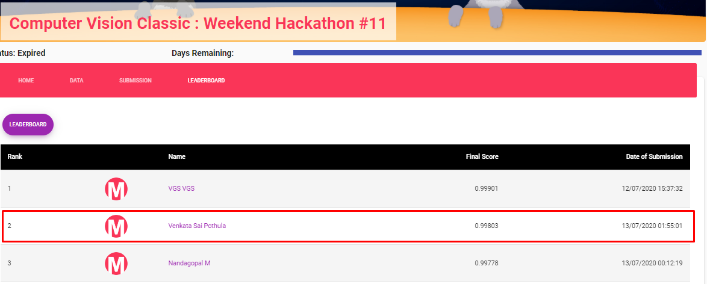
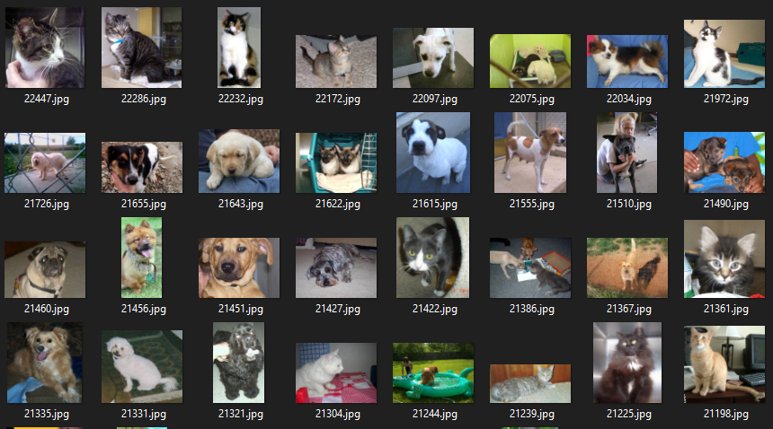

# Computer-Vision-Classic-Weekend-Hackathon
Rank 2nd/224 participants Repository of solution
## Leaderboard

## Data at a Glance

## Used My previous ComputerVision hackathon solution template: [Link](https://github.com/saikrithik/JanataHack-Computer-Vision-Hackathon)
#### Data Augmentation & Approach
- Regular Transformation and data augmentation.
- Used Fastai Resnet50 model.
#### Tools used
- Python for programming
- numpy library for methodology
- OpenCV for reading the images and stuff.
- fastai library for the model
- matplotlib and seaborn was used for plotting and analyzing the data
## Competition Result Private LB
Rank: 4th on public LB and 2nd on private LB \
[Link to LeaderBoard](https://www.machinehack.com/hackathons/5f05b7e78842ae057f62ece5)
